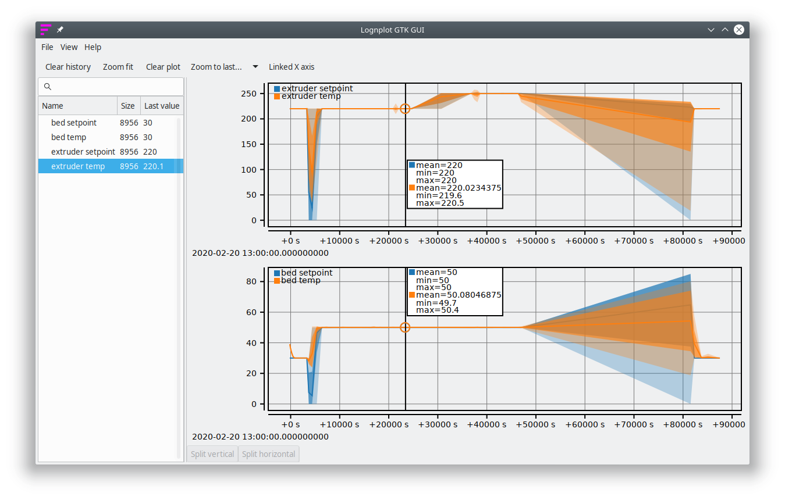

# `octoprint_serial_logs_lognplot`

Small Rust program that parses an [Octoprint](https://octoprint.org/) serial
log file to get the bed and extruder temperatures and send them to
a running instance of [lognplot](https://github.com/windelbouwman/lognplot).

An Octoprint serial log file looks like this:

```
2020-02-20 11:58:47,026 - Send: M105
2020-02-20 11:58:47,594 - Recv: ok T:220.0 /220.0 B:36.9 /30.0 T0:220.0 /220.0 @:35 B@:0 P:31.2 A:33.6
2020-02-20 11:58:48,776 - Recv: NORMAL MODE: Percent done: 1; print time remaining in mins: 61
2020-02-20 11:58:48,791 - Recv: SILENT MODE: Percent done: 3; print time remaining in mins: 60
2020-02-20 11:58:48,801 - Recv: NORMAL MODE: Percent done: 3; print time remaining in mins: 60
2020-02-20 11:58:48,817 - Recv: SILENT MODE: Percent done: 3; print time remaining in mins: 60
2020-02-20 11:58:49,035 - Send: M105
2020-02-20 11:58:49,761 - Recv: ok T:219.9 /220.0 B:36.9 /30.0 T0:219.9 /220.0 @:35 B@:0 P:31.2 A:33.6
```

The resulting plot:


